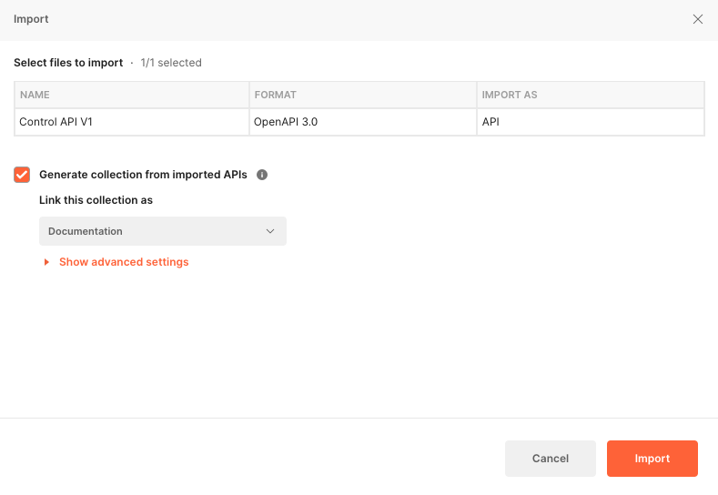
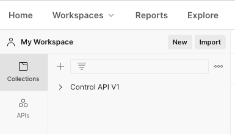
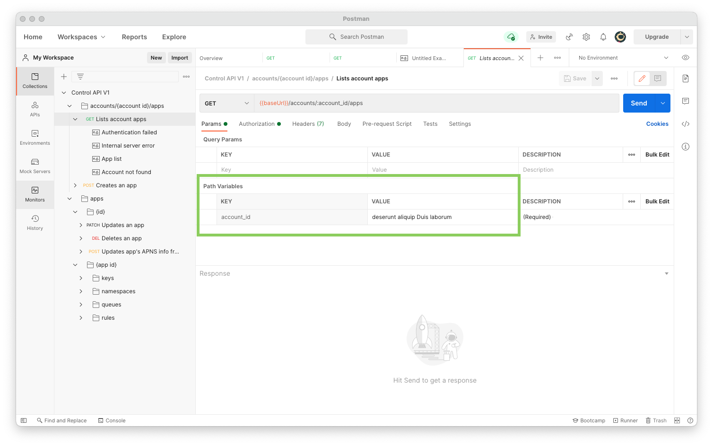
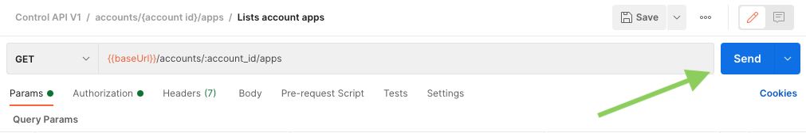
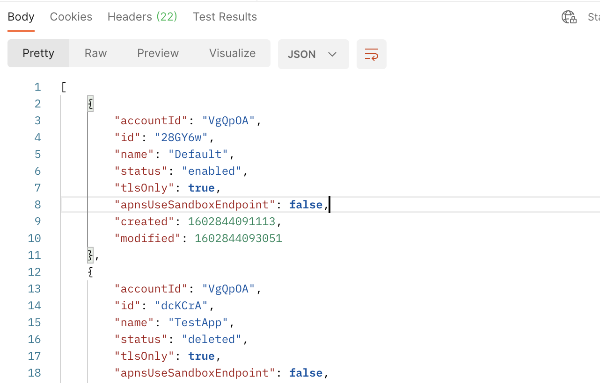

# Ably OpenAPI specifications

This repository contains Ably OAS3 specifications for the following REST APIs:

* Platform API
* Control API

## Versions

Each specification contains a version number. If a change is made that is breaking (that is, not backwards comptible) Ably will create a new specification file. For example, Control API version one is in `control-v1.yaml`, but version two would be in `control-v2.yaml`. When viewing locally in this repository, the latest specification is displayed by default. To view older versions of the specification, modify the files in the `openapi` folder to point to the version of the specification you'd like to view.

## Installation

The following command install the requirements (currently, only `http-server`):

```sh
npm install
```

## Viewing the specification locally

To View the specification locally, run: 

```
npm start
```

Point your browser at http://localhost:8080. You can then select the API reference of your choice, rendered by Redoc.

## Try out the REST APIs

There are several ways you can try out the API. You can use a command line tool such as Curl or HTTPie to test out various requests. Another way is to use a graphical tool such as Postman or Paw.

A convenient way to try out the REST APIs is by importing the OAS3 specification into [Postman](https://www.postman.com/). To do this, carry out the following steps. 

1. Make sure you have [Postman](https://www.postman.com/) installed.

2. Start Postman and select "File > Import" from the main menu. The import dialog is displayed:



3. Drag and drop the OAS3 specification you want to test, or use the "Upload file" button to select and import a specification.

4. On the Import dialog simply leave the default settings, and click "Import".

5. The imported specification will now appear in your Postman collections:



You are now ready to test out the API.

## Testing the Control API

Now that you have imported the specification into Postman, you are ready to try out the API. For Control API you need to configure your token. This token is used to authenticate your requests.

See the [documentation](ADD-LINK) on how to obtain your token.

For many Control API requests you will also need to specify your Account ID or Application ID. You can see the [documentation](ADD-LINK) for details on how to obtain these.

Now that you understand where to obtain these items, you will see how to configure and run a request in postman. 

The following screenshot shows the information for the "List account apps" request:



You need to configure your account ID in this case.

You also need to configure your token:


Without the token set, your request will fail to authenticate.

Now that everything is configured, you can send the request:



You receive back a response from the server:



You are now ready to try out other requests.

## About Ably

[Ably](https://ably.com) is a pub/sub messaging platform with a suite of integrated services to deliver realtime experiences such as interactive learning, logistics GPS tracking, and live sports updates.

Find out more about at [ably.com](https://ably.com).
