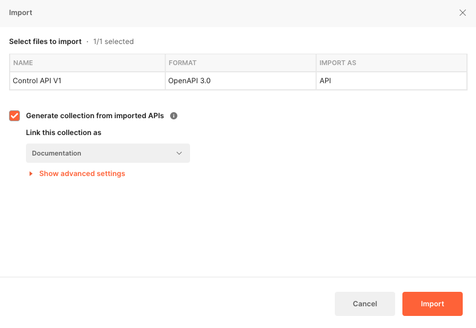
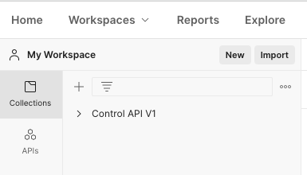
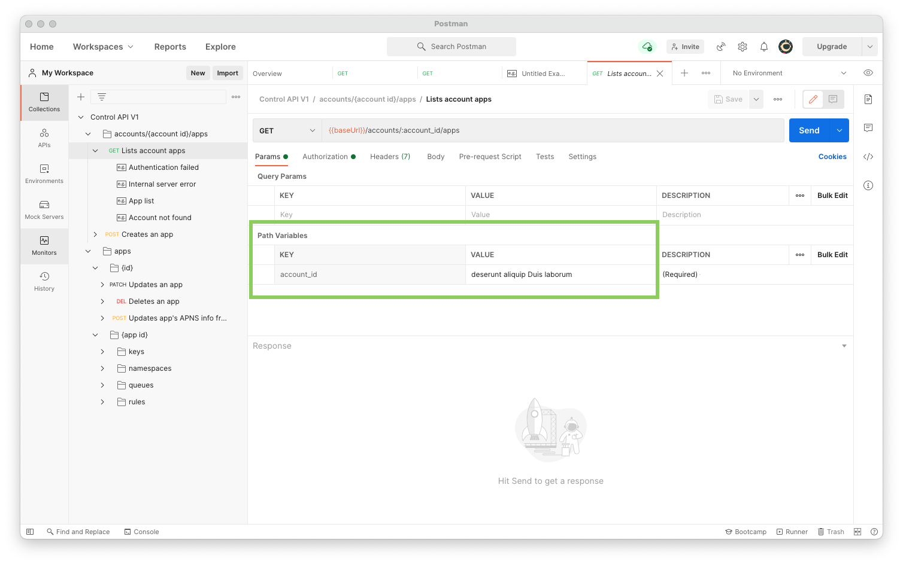
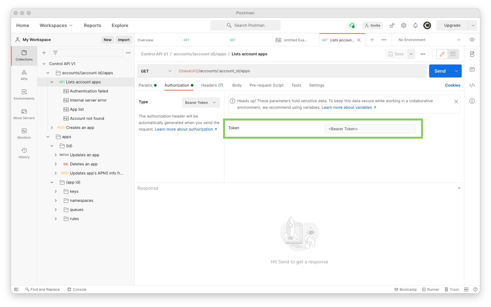
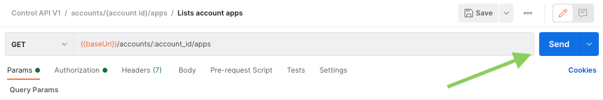
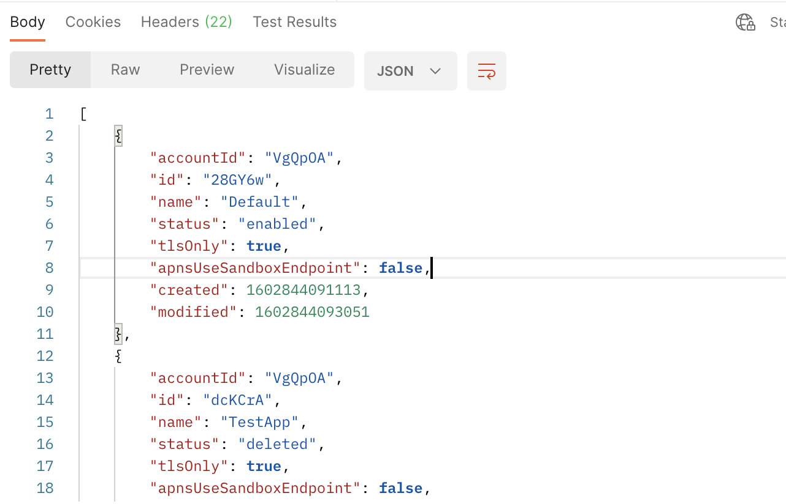

# Quickstart guide

This is a quickstart guide to help you use the APIs as quickly as possible. You can see our [main documentation](https://ably.com/documentation) for more detail.

## Try out the REST APIs with Postman

There are a few ways you can try out the APIs. You can use a command line tool such as Curl or HTTPie to test out various requests. Another way is to use a graphical tool such as Postman or Paw.

A convenient way to try out the REST APIs is by importing the OAS3 document into [Postman](https://www.postman.com/). To do this, carry out the following steps:

1. Make sure you have [Postman](https://www.postman.com/) installed.

2. Start Postman and select "File > Import" from the main menu. The import dialog is displayed:

3. Drag and drop the OAS3 document you want to test, or use the "Upload file" button to select and import a document.

4. On the Import dialog simply leave the default settings, and click "Import".

5. The imported API now appears in your Postman collections:

You are now ready to test out the API.

## Testing the Control API

Now that you have imported the OAS3 document into Postman, you are ready to try out the API. For Control API you first need to configure your token. This token is used to authenticate your requests.

See the [documentation](https://ably.com/documentation/control-api#authentication) on how to obtain your token.

For many Control API requests you also need to specify your Account ID or Application ID. You can see the [documentation](https://ably.com/documentation/control-api#ids) for details on how to obtain these.

Once you have obtained the necessary tokens and IDs, you can configure and run a request in Postman. 

The following screenshot shows the information for the "List account apps" request:

You need to provide your account ID in this case.

You also need to provide your token to authenticate the request:

Now that you have provided the necessary token and account ID, you can send the request:

You receive back a response from the server:

You are now ready to try out other requests.
